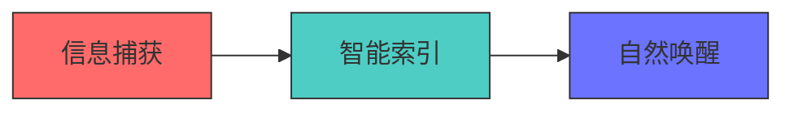

  <h1>📼 Recalline</h1>
  <h3>你的数字记忆中枢 —— 用时空索引技术对抗信息过载</h3>
  
  

---

## 🌟 产品本质
Recalline 是首个**时空记忆引擎**，通过多模态AI重建人类记忆方式：

| 核心能力               | 技术实现                     |
|-----------------------|----------------------------|
| 🕒 连续时间轴记录       | 纳秒级事件打标 + 操作流重建  |
| 🔍 语义化搜索           | 70B参数多模态大模型          |
| 🧠 智能遗忘             | 基于LRU的渐进记忆衰减算法     |

---

## 🎯 场景革命

### 传统方式 vs Recalline方案
<table>
  <tr>
    <th width="40%">传统困扰</th>
    <th width="60%">Recalline方案</th>
  </tr>
  <tr>
    <td>🔎 翻浏览器历史+逐个网页排查</td>
    <td>💡 输入问题描述直达当时的解决方案</td>
  </tr>
  <tr>
    <td>📝 聊天记录关键词搜索不准确</td>
    <td>✨ 用自然语言描述查找相关对话</td>
  </tr>
  <tr>
    <td>🎙️ 会议要点记忆模糊</td>
    <td>⏱️ 按时间轴查看当时的讨论内容</td>
  </tr>
</table>